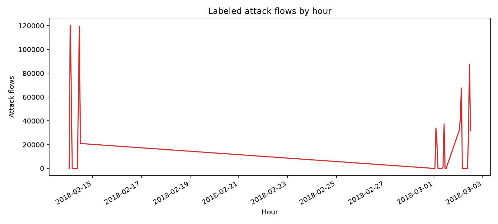

# Network Intrusion SQL Analytics

Eighteen SQL questions and an interactive dashboard over labeled network **flow features** from [CSE-CIC-IDS2018](https://www.unb.ca/cic/datasets/ids-2018.html). This analyzes traffic mix, attack concentration, ports, protocols, flow shapes, and a transparent detection rule. It complements packet-level hunts by looking at fleet-wide labeled flow behavior.

**Start with:** [Findings](FINDINGS.md) · [SQL questions](sql/) · [Results](results/) · [Dashboard screenshot](screenshots/dashboard.png)



## Run

```bash
python3 -m venv .venv
source .venv/bin/activate
pip install -r requirements.txt
python scripts/download.py
python scripts/build_db.py
python scripts/run.py
streamlit run dashboard.py
```

The downloader retrieves three processed CSV days from the [public AWS dataset bucket](https://registry.opendata.aws/cse-cic-ids2018/): February 14 (FTP/SSH brute force), March 1 (infiltration), and March 2 (bot). Together they contain 2,428,245 valid flows after repeated headers and five implausible 1970 timestamps are removed. These selected days are a **scenario slice**, not a random or representative sample of the whole release. Raw CSVs total about 800 MB and remain untracked under `data/raw/`.

| Component | Details |
| --- | --- |
| Source | CSE-CIC-IDS2018 processed flow features, three selected days |
| Engine | DuckDB 1.x, curated numeric flow columns |
| SQL | 18 independent questions in `sql/` |
| Outputs | CSV and Markdown in `results/`, PNG in `charts/` |
| Dashboard | Streamlit + Plotly, source-day filters |

## Questions

The SQL explores class mix, day and hour shifts, peak attack hours, destination ports, protocol mix, flow duration and bytes, upload and packet asymmetry, packet rate, SYN flags, short flows, hour-port hotspots, a simple short-SYN rule, and data quality. Each file starts with its question.

The source spells its infiltration label `Infilteration`; this project preserves that exact value to avoid silently changing source labels. The curated table omits source IP and destination IP because the selected processed files do not supply them. As a result, this project does not claim to reconstruct host-level attack paths.

## Source and license

The data was produced by the Communications Security Establishment and the University of New Brunswick's Canadian Institute for Cybersecurity. Follow the [source dataset terms](https://www.unb.ca/cic/datasets/ids-2018.html) for reuse. This repository does not redistribute the raw CSVs. Original project code is MIT licensed; see [LICENSE](LICENSE).
